# End to End LLMOps with Prompt flow and GitHub Actions

Azure Machine Learning allows you to integrate with [GitHub Actions](https://docs.github.com/actions) to automate the machine learning lifecycle.  In the context of building applications on the top of the LLM, Azure Machine Learning prompt flow is a development tool designed to streamline the entire development cycle of AI applications powered by Large Language Models (LLMs). With Azure Machine Learning prompt flow, you'll be able to:

- Create executable flows that link LLMs, prompts, and Python tools through a visualized graph.
- Debug, share, and iterate your flows with ease through team collaboration.
- Create prompt variants and evaluate their performance through large-scale testing.
- Deploy a real-time endpoint that unlocks the full power of LLMs for your application.

For this workshop following are some of the operations we will automate:

- Running Prompt flow after a Pull Request
- Running Prompt flow evaluation to ensure results are high quality
- Registering of prompt flow models
- Deployment of prompt flow models

> [!TIP]
> We recommend you understand how [Prompt flow works](https://learn.microsoft.com/en-us/azure/machine-learning/prompt-flow/get-started-prompt-flow?view=azureml-api-2)

## Prerequisites

- An Azure subscription. If you don't have an Azure subscription, create a free account before you begin. Try the [free or paid version of Machine Learning](https://azure.microsoft.com/free/).
- A Machine Learning workspace.
- Git running on your local machine.
- GitHub as the source control repository
- Visual studio code with [Azure Machine Learning extension](https://marketplace.visualstudio.com/items?itemName=ms-toolsai.vscode-ai) installed.
- [Azure CLI](https://docs.microsoft.com/cli/azure/install-azure-cli) installed on your local machine.
- [Azure Machine Learning CLI extension](https://docs.microsoft.com/cli/azure/ext/azure-cli-ml/ml?view=azure-cli-latest) installed on your local machine.
- [GitHub CLI](https://cli.github.com/) installed on your local machine.
- [Python 3.9 or later](https://www.python.org/downloads/) installed on your local machine.
- [Install Prompt Flow Extension](https://marketplace.visualstudio.com/items?itemName=prompt-flow.prompt-flow)
- Custom Environment.  Go to Azure ML Workspace -> Assets -> Environments -> Custom Environments -> Create.  Select the following configuration
  - Name - entaoaienv
  - Select environment source - Use existing docker image with optional conda file
  - Container registry image path - docker pull akshata13/chatpdfenv:latest
  - Click Next, Next on Tags and Click Create on Review screen
  - 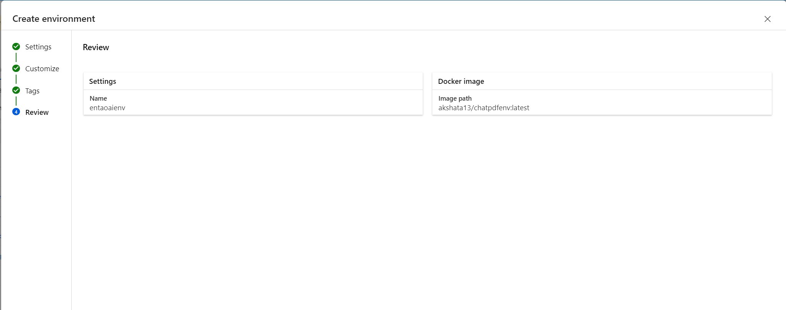
- Create new Compute Instance (Azure ML Workspace -> Manage -> Compute -> Compute Instance -> Create).  Select the following configuration
  - Compute name - entaoai
  - VM Type - CPU
  - VM Size - Selected from recommended options - Standard_DS11_v2
  - Click Review + Create
  - Click Create
  - 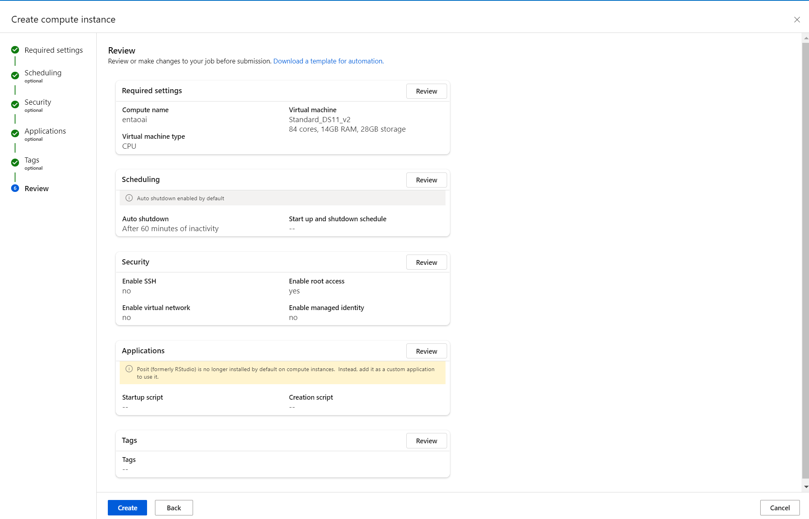
- Custom Runtime (Azure ML Workspace -> Authoring -> Prompt Flow -> Runtime -> Create).  Select the following configuration.
  - Runtime name - entaoai
  - Select Azure ML compute instance -> entaoai
  - Custom Application -> New
  - Environment -> use customized environment -> entaoaienv:1
  - Click Create
  - 

## Set up authentication with Azure and GitHub

Before you can set up an Prompt flow project with Machine Learning, you need to set up authentication for Azure GitHub.

### Create service principal

   Create one service principal for this demo (or use the one that you created for the other github actions we are using for deploying the Azure Functions and Azure Web App). You can add more depending on how many environments, you want to work on (Dev or Prod or Both). Service principals can be created using one of the following methods:

    ``` bash
    roleName="Contributor"
    subscriptionId="<subscription Id>"
    servicePrincipalName="chatpdf"
    # Verify the ID of the active subscription
    az login
    echo "Using subscription ID $subscriptionID"
    echo "Creating SP for RBAC with name $servicePrincipalName, with role $roleName and in scopes     /subscriptions/$subscriptionId"
    az ad sp create-for-rbac --name $servicePrincipalName --role $roleName --scopes /subscriptions/$subscriptionId --sdk-auth 
    echo "Please ensure that the information created here is properly save for future use."
    ```
After running these commands, you'll be presented with information related to the service principal. Save this information to a safe location, you'll use it later in the demo to configure GitHub.

    ```json

      {
      "clientId": "<service principal client id>",  
      "clientSecret": "<service principal client secret>",
      "subscriptionId": "<Azure subscription id>",  
      "tenantId": "<Azure tenant id>",
      "activeDirectoryEndpointUrl": "https://login.microsoftonline.com",
      "resourceManagerEndpointUrl": "https://management.azure.com/", 
      "activeDirectoryGraphResourceId": "https://graph.windows.net/", 
      "sqlManagementEndpointUrl": "https://management.core.windows.net:8443/",
      "galleryEndpointUrl": "https://gallery.azure.com/",
      "managementEndpointUrl": "https://management.core.windows.net/" 
      }
    ```

Copy all of this output, braces included. Save this information to a safe location, it will be use later in the demo to configure GitHub Repo.

### Create the User Assigned Managed Identity

Run the [UAMI Setup](./Workshop/2B0_UAMI%20Setup.ipynb) notebook to create the User Assigned managed identity in your subscription.  Once created, the user's managed identity must have following [permissions](https://learn.microsoft.com/en-us/azure/machine-learning/prompt-flow/how-to-deploy-for-real-time-inference?view=azureml-api-2) granted

- AzureML Data Scientist to AML Workspace
- Acr Pull for Workspace container registry
- Storage Blob Data Reader to Workspace default storage
- Workspace metrics writer to AML Workspace

### Add secret to GitHub Repo

1. From your GitHub project, select **Settings**:
2. Then select **Secrets**, then **Actions**:
   
3. Select **New repository secret**. Name this secret **AZURE_RBAC_CREDENTIALS** and paste the service principal output as the content of the secret.
   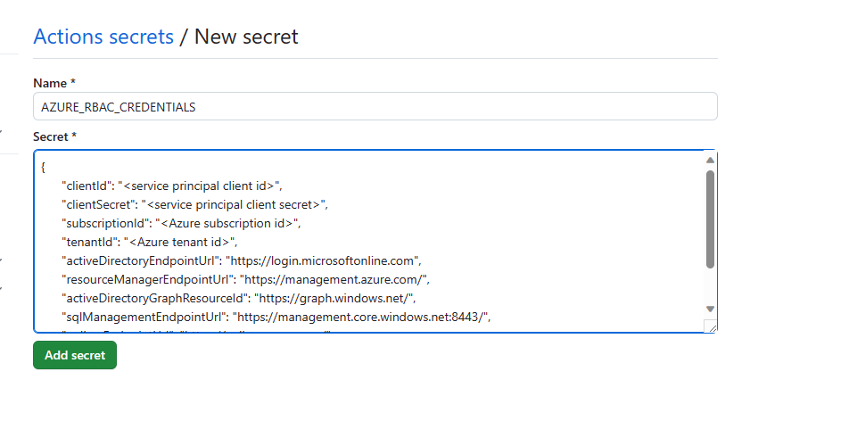
4. Add each of the following additional GitHub secrets using the corresponding values:  
    - **GROUP**  (Resource group name)
    - **WORKSPACE**  (AML workspace name)
    - **SUBSCRIPTION**  (Subscription ID)
    - **CLIENT_ID** (Service principal client ID)
    - **LOCATION** (Location of your workspace)
    - **PRINCIPAL_ID** (Service principal ID of UAMI)
    - **STORAGE_ACCOUNT** (AML storage account name)
    - **RUNTIME_NAME** (Promptflow runtime name - entaoai)
    - **TENANT_ID** (Azure tenant ID)
    - **UAMI_NAME** (UAMI name)
  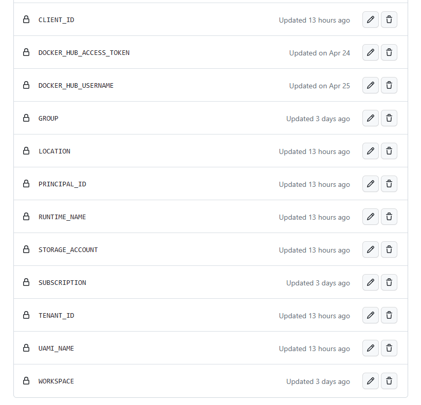
  
## Setup connections for Prompt flow 

Connection helps securely store and manage secret keys or other sensitive credentials required for interacting with LLM and other external tools.  For this LLMOps example we are using the Question Answering capability of the application.  

For the LLMOps examples all the artifacts are stored in [Prompt flow Folder](./Workshop/promptflow/).  [llmopsqa](./Workshop/promptflow/llmopsqa/) folder implements the Question Answering capability using the PromptFlow and RAG pattern.  Within the Prompt Flow folder [Environment](./Workshop/promptflow/environment/) is what defines the runtime environment for the Prompt Flow.  Details around creating custom runtime for Prompt flow is [Documented](https://learn.microsoft.com/en-us/azure/machine-learning/prompt-flow/how-to-customize-environment-runtime?view=azureml-api-2#customize-environment-with-docker-context-for-runtime).  All  YAML definition for [deployment](./Workshop/promptflow/deployment/) are available in the deployment folder.
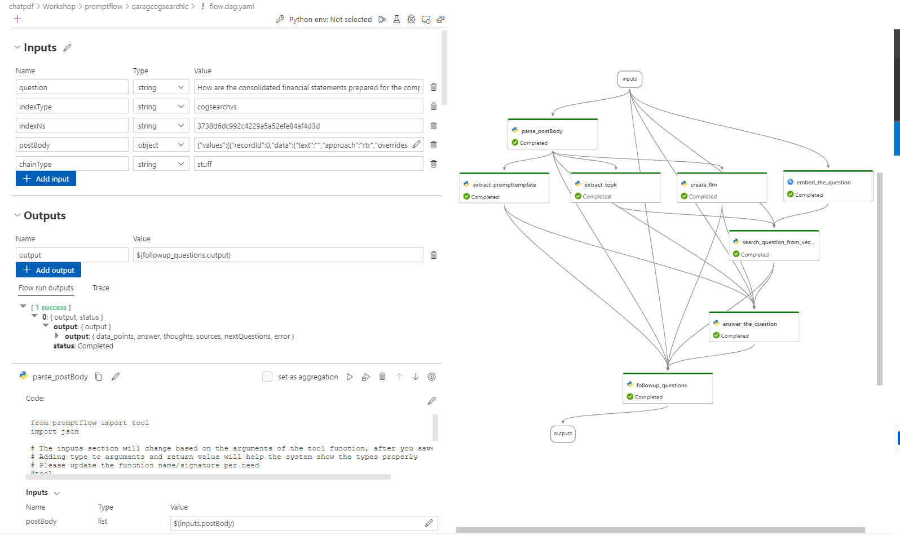

As a part of the workflow, there are connections that are used, which you will need to create manually (until automated). Please go to workspace portal, click `Prompt flow` -> `Connections` -> `Create`, then follow the instruction to create your own connections called `llmops`. Learn more on [connections](https://learn.microsoft.com/en-us/azure/machine-learning/prompt-flow/concept-connections?view=azureml-api-2).  The example connections definition is available for [entaoai](./Workshop/promptflow/entaoai.example.yml) and [aoaicg](./Workshop/promptflow/aoaicg.example.yml) or alternatively you can use [Notebook](./Workshop/2B1_AskQuestionPromptFlow.ipynb) to create those connections using SDK or CLI.
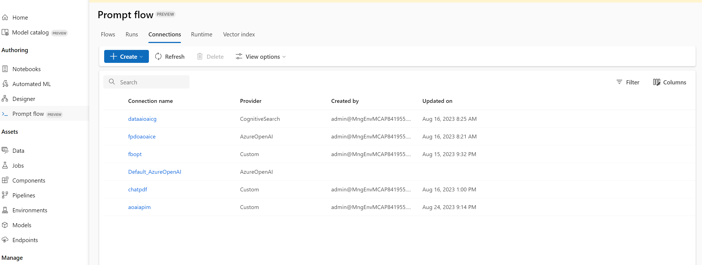

`aoai` connection
Go to Azure ML Workspace -> Prompt Flow -> Connections -> Create -> Azure OpenAI.  Select the following configuration.  **Note** Ensure the model deployment name matches to what you have deployed in Azure OpenAI.
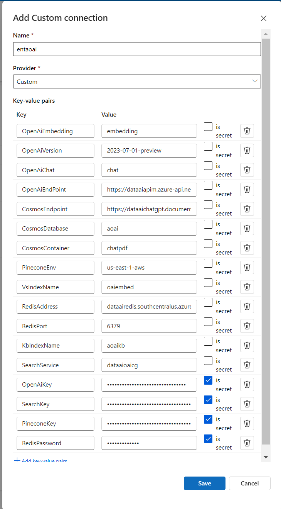

## Sample Prompt Run, Evaluation and Deployment Scenario

This is a flow demonstrating question answering with LLM. Given an question, it will find the answer from the knowledge base (index created in different vector database).

In this flow, this training pipeline contains the following steps:

### **Run Prompts in Flow**

- Compose a RAG Pattern for Question Answering using Prompt flow with LLM.
- Upload prompt test dataset,
- Bulk run prompt flow based on dataset.

### **Evaluate Results**

- Upload ground test dataset
- Evaluation of the bulk run result and new uploaded ground test dataset

### **Register Prompt Flow LLM App**

- Check in logic, Customer defined logic (accuracy rate, if >=90% you can deploy)

### **Deploy and Test LLM App**

- Deploy the PF as a model to production
- Test the model/promptflow realtime endpoint.

## Run and Evaluate Prompt Flow in AzureML with GitHub Actions

Using a [GitHub Action workflow](https://learn.microsoft.com/en-us/azure/machine-learning/how-to-github-actions-machine-learning?view=azureml-api-2&tabs=userlevel#step-5-run-your-github-actions-workflow) we will trigger actions to run a Prompt Flow job in Azure Machine learning.

This pipeline will start the prompt flow run and evaluate the results. When the job is complete, the prompt flow model will be registered in the Azure Machine Learning workspace and be available for deployment.
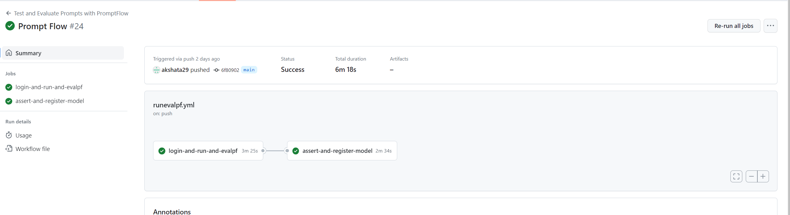

1. In your GitHub project repository, select **Actions**
2. Select the `llmopsrunevalpf.yml` from the workflows listed on the left and the click **Run Workflow** to execute the Prompt flow run and evaluate workflow. This will take several minutes to run.
   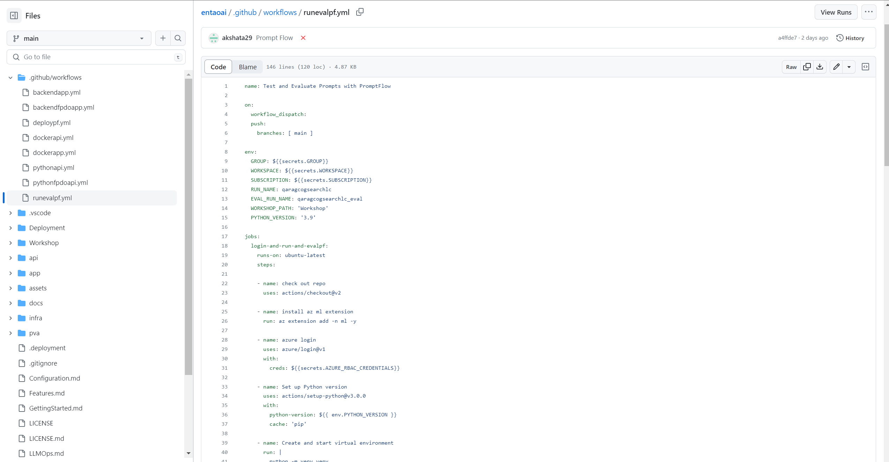
3. The workflow will only register the model for deployment, if the accuracy of the classification is greater than 60%. You can adjust the accuracy thresold in the `llmopsrunevalpf.yml` file in the `jobMetricAssert` section of the workflow file. The section should look like:

    ```yaml

    id: jobMetricAssert
    run: |
        export ASSERT=$(python promptflow/llmops-helper/assert.py result.json 0.6)
    ```

    You can update the current `0.6` number to fit your preferred threshold.

4. Once completed, a successful run and all test were passed, it will register the Prompt Flow model in the Machine Learning workspace. With the Prompt flow model registered in the Machine learning workspace, you are ready to deploy the model for scoring.
   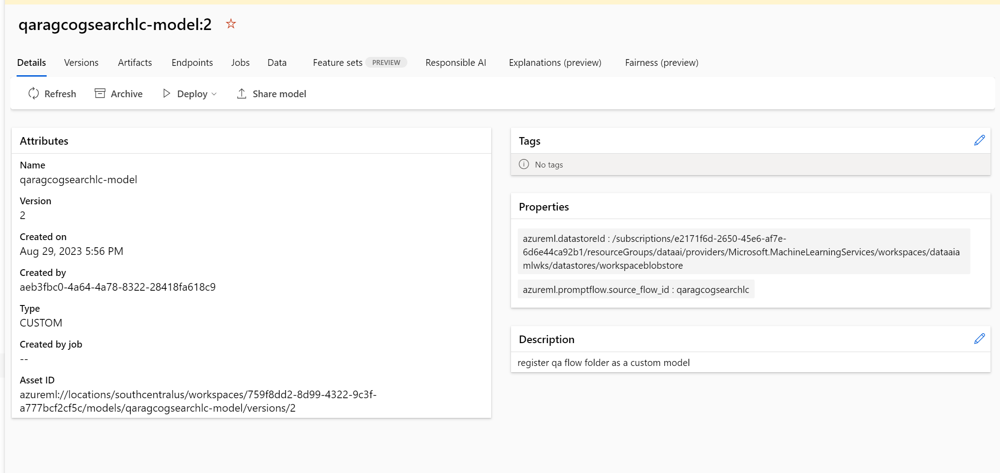
   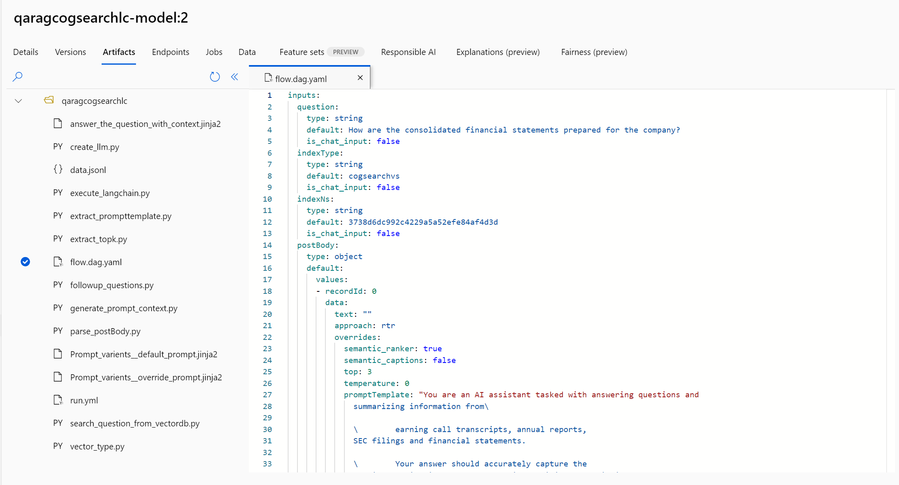

## Deploy Prompt Flow in AzureML with GitHub Actions

This scenario includes prebuilt workflows for two approaches to deploying a trained model, batch scoring or a deploying a model to an endpoint for real-time scoring. You may run either or both of these workflows to test the performance of the model in your Azure Machine Learning workspace.

### Online Endpoint

1. In your GitHub project repository , select **Actions**
2. Select the **llmopsdeploypf** from the workflows listed on the left and click **Run workflow** to execute the online endpoint deployment pipeline workflow. The steps in this pipeline will create an online endpoint in your Machine Learning workspace, create a deployment of your model to this endpoint, then allocate traffic to the endpoint.
   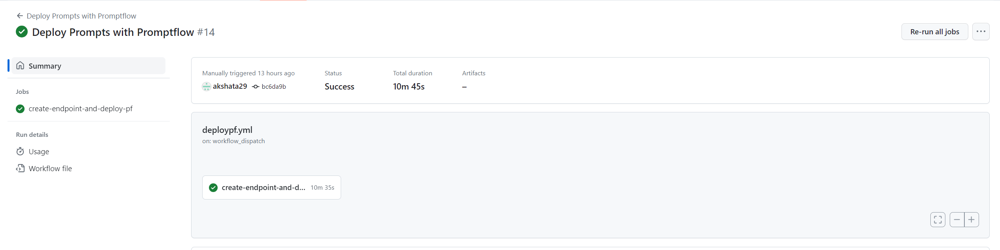
   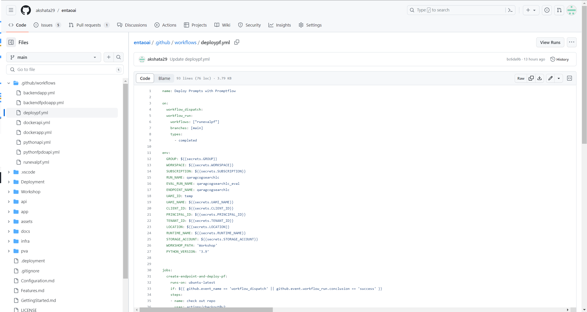
3. Once completed, you will find the online endpoint deployed in the Azure Machine Learning workspace and available for testing.
   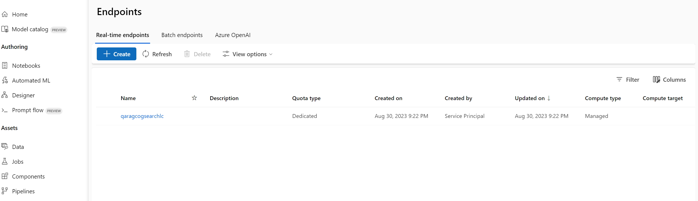
   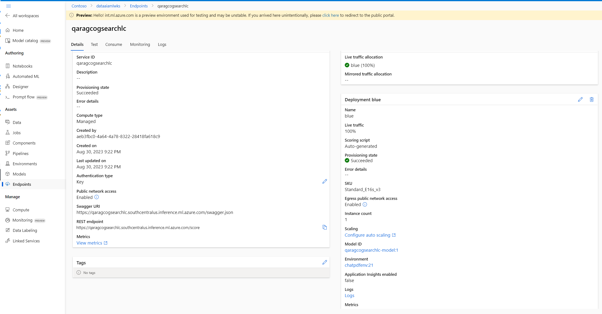
4. To test this deployment, go to the **Endpoints** tab in your Machine Learning workspace, select the endpoint and click the **Test** Tab. You can use the sample input data located in the cloned repo at `/deployment/sample-request.json` to test the endpoint
   Alternatively, run the CLI command

    ```bash
    az ml online-endpoint invoke --name ${{env.ENDPOINT_NAME}} --request-file promptflow/deployment/sample-request.json  -g ${{env.GROUP}} -w ${{env.WORKSPACE}} 
    ```

    You can also use Client like Postman to execute the Rest API
    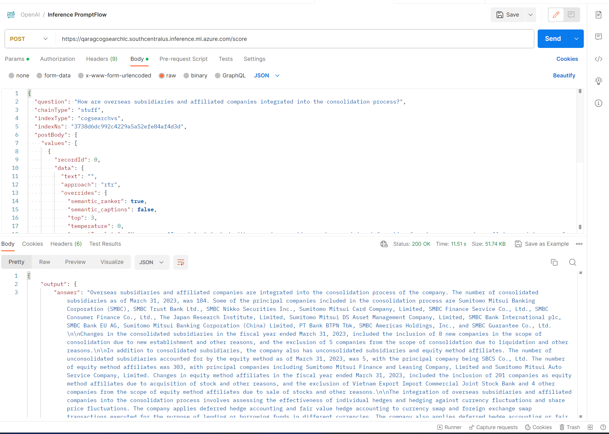

## Moving to production

This example scenario can be run and deployed both for Dev and Prod branches and environments. When you are satisfied with the performance of the prompt evaluation pipeline, Prompt Flow model, and deployment in Testing, Dev pipelines and models can be replicated and deployed in the Production environment.

The sample Prompt flow run & evaluation and GitHub workflows can be used as a starting point to adapt your own prompt engineering code and data.
