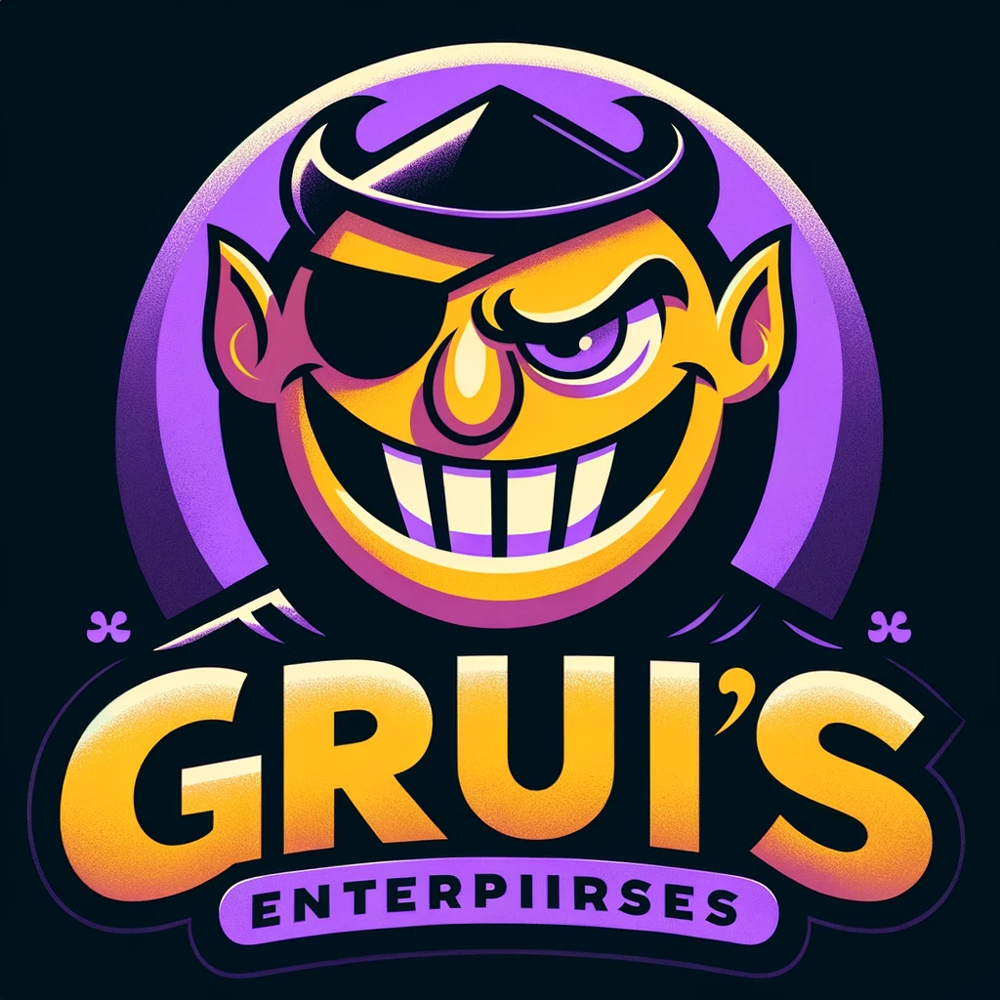
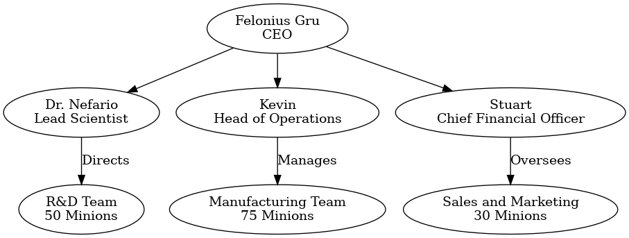
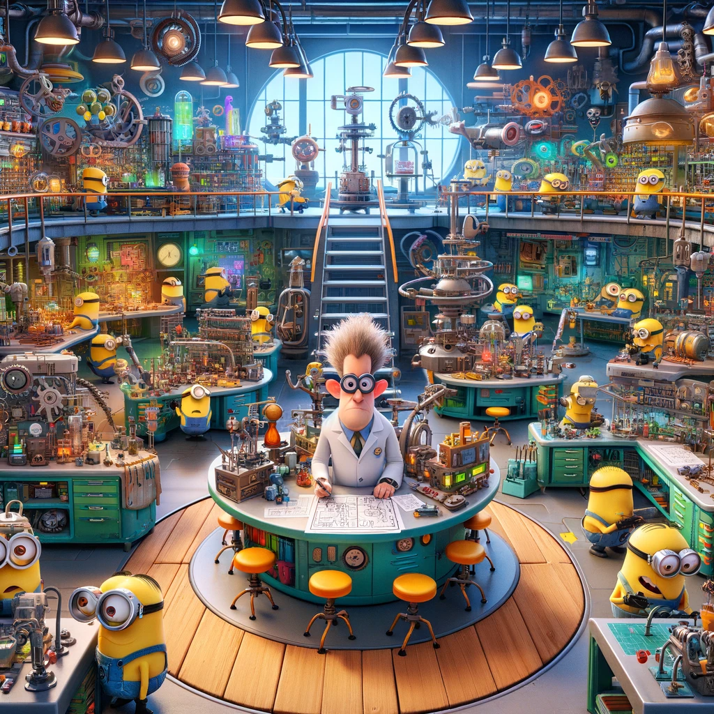
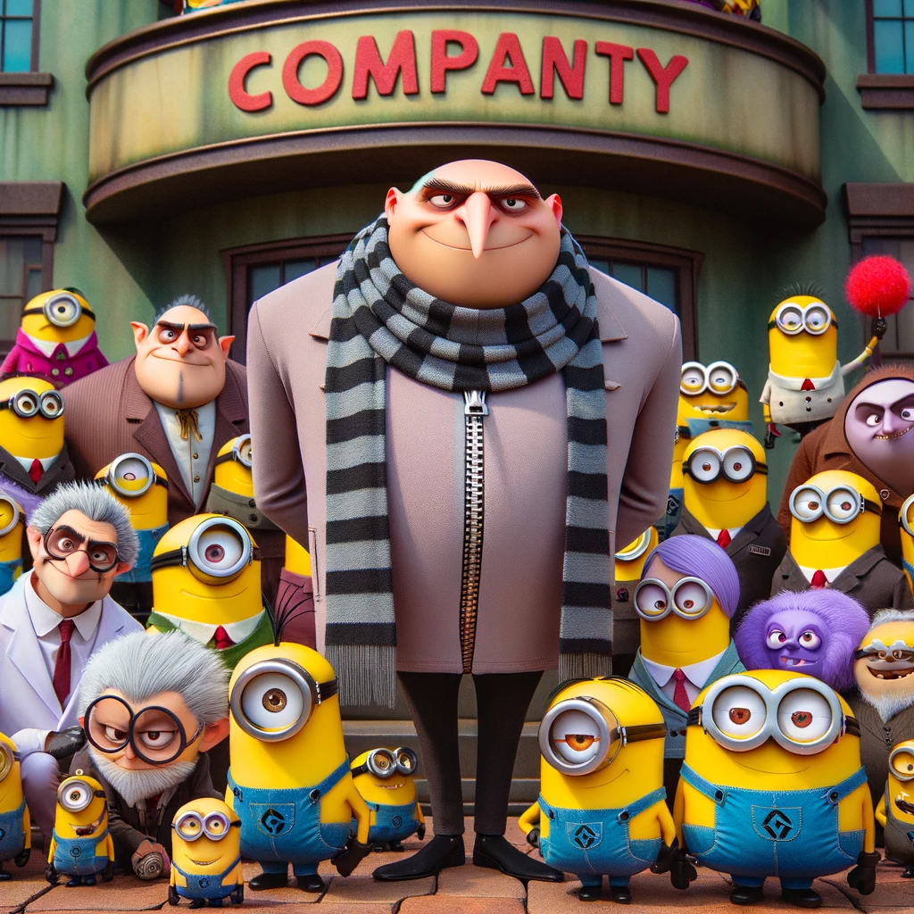
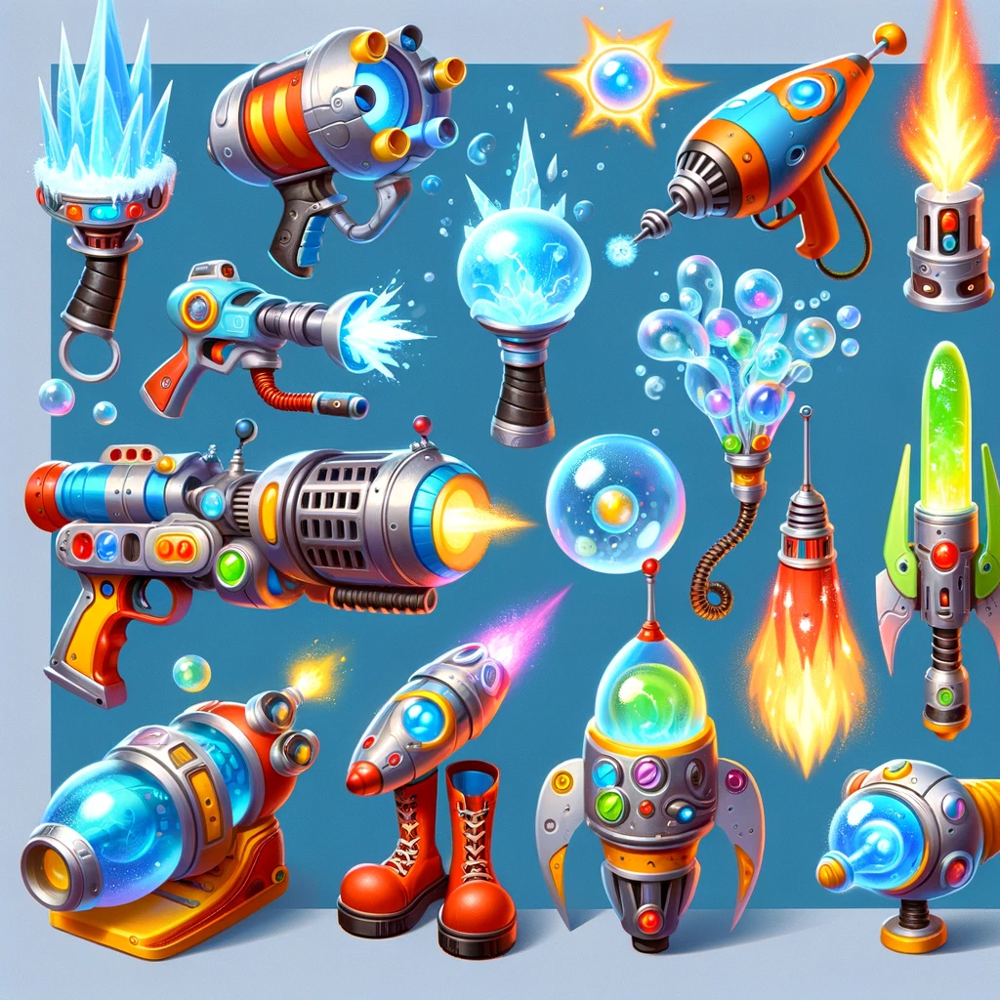
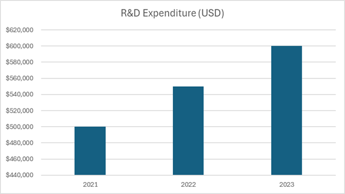
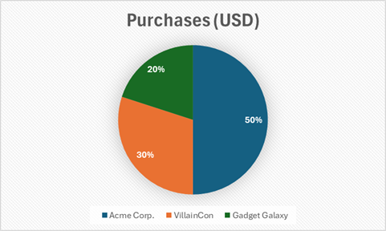
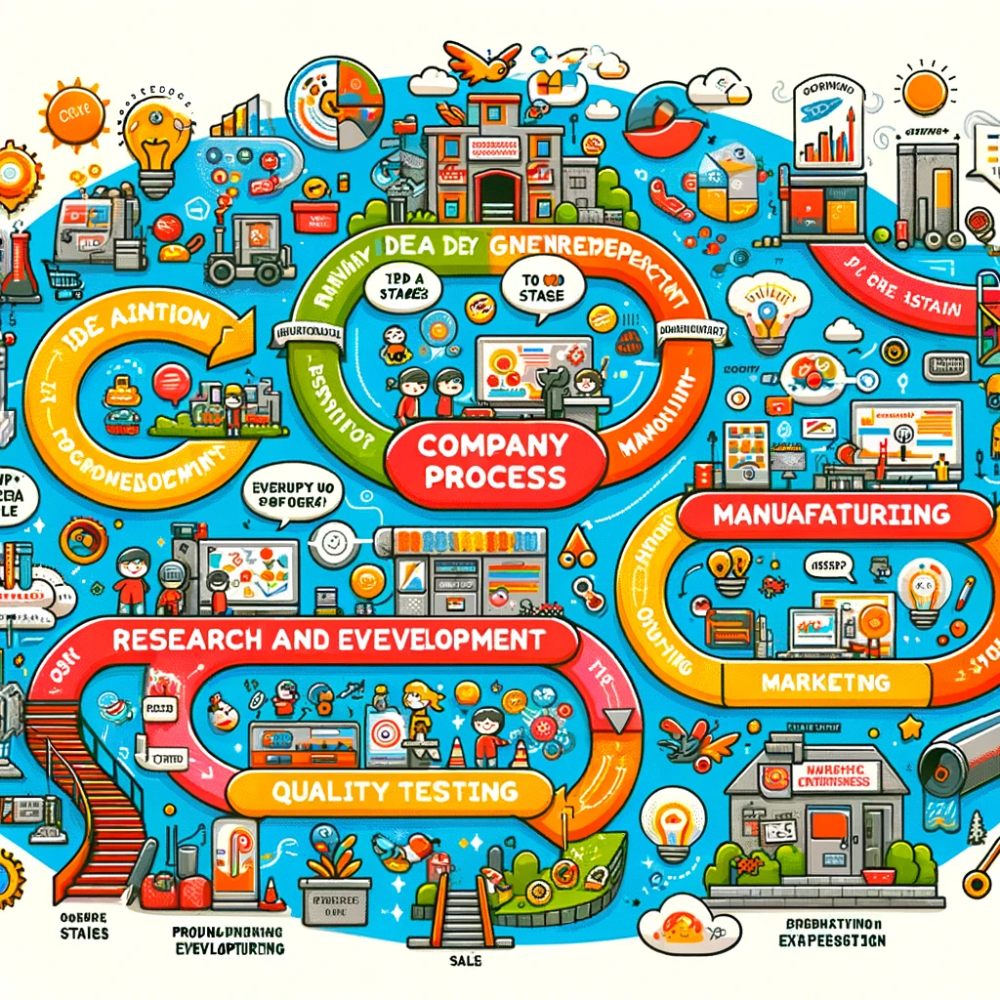
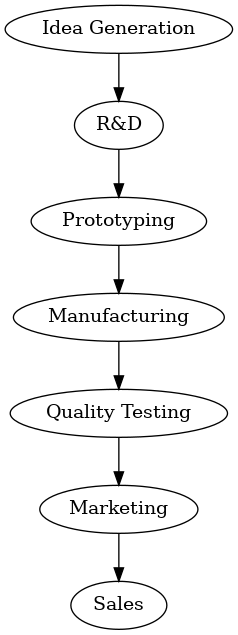

# Business Analysis Document

## Gru's Enterprises: Innovation in Cartoonish "Evil" Weaponry

### Address: 
123 Villain Street, Villainville, EV123

### Contact Information:
- **Phone:** 123-456-7890
- **Email:** contact@grusenterprises.com
- **Website:** www.grusenterprises.com

### Prepared by:
Gru's Enterprises Financial Analysis Team

### Date of Preparation:
January 6, 2024

---

**Confidential and Proprietary Information**

This document contains confidential and proprietary information of Gru's Enterprises. It is intended solely for the use of the individual or entity to which it is addressed. If you are not the intended recipient, you are hereby notified that any use, dissemination, distribution, or copying of this document is strictly prohibited.

---

 
\pagebreak 

### Table of Contents

1. **Executive Summary**
   - Overview of Gru's Business Model
   - Key Financial Highlights

2. **Company Overview**
   - History and Background
   - Mission and Vision
   - Organizational Structure

3. **Product Portfolio**
   - Description of Key Products
   - Innovation and R&D

4. **Market Analysis**
   - Target Market and Clientele
   - Competitive Landscape

5. **Financial Analysis**
   - Revenue Streams
   - Cost Analysis
   - Profitability Analysis

6. **Operational Overview**
   - Manufacturing Process
   - Supply Chain Management

7. **Human Resources**
   - Staffing and Roles
   - Compensation and Benefits

8. **Strategic Challenges and Opportunities**
   - Market Risks
   - Future Growth Opportunities

9. **Investment Appeal**
   - Investment Needs
   - Return on Investment Projections

10. **Appendices**
    - Financial Statements
      - Balance Sheet
      - Cash Flow Statement
    - Tables
      - R&D Costs
      - Best-selling Products Analysis
      - Top Clients and Purchases
      - Geographical Distribution of Product Use
    - Infographics and Diagrams
      - Organizational Chart
      - Process Flow Diagrams
    - Images
      - R&D Lab
      - Company Group Photo
      - Close-ups of Cartoon Weapons

 
\pagebreak 

### 1. Executive Summary

#### Overview of Gru's Business Model

Gru's Enterprises, a novel venture in the world of light-hearted villainy, specializes in the design and manufacture of unique, cartoonish "evil" weapons. These products, appealing to a niche market of enthusiasts, are crafted with a touch of humor and imagination. Our product range, from freeze rays to rocket boots, combines innovation with practical jokes, providing an unparalleled experience in the realm of fantasy weaponry.

#### Key Financial Highlights

- **Total Revenue (2023):** $4.2 million
- **Gross Profit Margin:** 40%
- **Net Profit Margin:** 2%
- **Total Operating Expenses:** $3.8 million
- **EBITDA:** $300,000
- **Current Assets:** $2.5 million
- **Long-term Liabilities:** $1.7 million

---

 
\pagebreak 

### 2. Company Overview

#### History and Background

Founded by the infamous yet endearing supervillain Gru, our company began as a small workshop in a suburban basement. It has since grown into a significant player in the fantastical weaponry market. The journey from crafting simple gadgets to sophisticated, laughter-inducing weapons is a testament to our dedication and creativity.

#### Mission and Vision

Our mission is to provide a touch of mischievous joy through our unique products. We envision a world where humor and imagination are integral to everyday life, and we strive to be at the forefront of this whimsical revolution.

#### Organizational Structure

 

 

 
\pagebreak 

### 3. Product Portfolio

#### Description of Key Products

Gru's Enterprises boasts a diverse range of cartoonish "evil" weapons, each with its unique flair and mischievous functionality. Our top products include:

1. **Freeze Ray:** A popular item, especially in pranks and mock battles. Features adjustable settings for different freeze durations.
2. **Rocket Boots:** Equipped with multi-directional propulsion, these boots are a hit among adventure enthusiasts.
3. **Bubble Gun:** Emits oversized, shimmering bubbles, perfect for light-hearted escapades and festive occasions.

These products, while playful, incorporate advanced technology and innovative design, ensuring safety and a fun experience for users.

#### Innovation and R&D

Investment in R&D is pivotal to our success. With an annual R&D budget of $600,000, we focus on developing new products and enhancing existing ones. Our team, led by Dr. Nefario, is committed to pushing the boundaries of imagination and technology.

---

 
\pagebreak 

### 4. Market Analysis

#### Target Market and Clientele

Our products appeal to a wide range of customers, from children and families looking for fun gadgets to hobbyists interested in unique collectibles. Our marketing strategy targets both domestic and international markets, with a particular focus on regions with a high interest in novelty items.

#### Competitive Landscape

While our market niche is relatively unique, we face competition from other companies in the entertainment and novelty sectors. Our competitive edge lies in our brand's recognizability and the unparalleled creativity of our products.

---

### 5. Financial Analysis

#### Revenue Streams

Our primary revenue comes from direct product sales, both online and through select retail partnerships. We also generate income from licensing deals and merchandising.

#### Cost Analysis

Major costs include:

- Material Costs: $1.2 million
- Labor: $1.5 million (including minion salaries)
- Marketing: $300,000
- R&D: $600,000

#### Profitability Analysis

Despite high costs, especially in R&D and labor, our unique market position allows for a steady, though modest, profit margin. Continuous investment in marketing and product development is essential for future growth and profitability.

---

 
\pagebreak 

### 6. Operational Overview

#### Manufacturing Process

Our manufacturing process is streamlined for efficiency and innovation. The workflow is divided into several stages:

1. **Design and Prototyping:** Led by Dr. Nefario and his team, this stage involves brainstorming, sketching, and creating prototypes.
2. **Material Sourcing:** We source high-quality, durable materials, ensuring our products are safe and long-lasting.
3. **Assembly:** Minions handle the assembly with precision and care, adhering to strict quality control standards.
4. **Testing:** Each product undergoes rigorous testing to ensure it meets our safety and performance criteria.

#### Supply Chain Management

We manage a robust supply chain, balancing cost-effectiveness with quick turnaround times. Our logistics team, supervised by Minion Kevin, ensures timely delivery of materials and finished products.

---

 
\pagebreak 

### 7. Human Resources

#### Staffing and Roles

Our dedicated team is our greatest asset. We employ over 150 minions in various roles, from R&D to manufacturing and sales. Each minion undergoes specialized training to excel in their respective areas.

#### Compensation and Benefits

We offer competitive salaries and a comprehensive benefits package, including healthcare, retirement plans, and ample vacation time. Our unique workplace culture fosters creativity and teamwork, making Gru's Enterprises a desirable place to work.

---

 
\pagebreak 

### 8. Strategic Challenges and Opportunities

#### Market Risks

Our business faces several risks, including market fluctuations and changing consumer preferences. The novelty market is fickle, and staying ahead requires constant innovation and adaptability.

#### Future Growth Opportunities

We are exploring expansion into new markets and product lines. Potential areas include interactive digital experiences and themed entertainment ventures. Strategic partnerships and brand collaborations are also on the horizon to broaden our reach.

---

 
\pagebreak 

### 9. Investment Appeal

#### Investment Needs

To achieve our next phase of growth and innovation, we are seeking an investment of $2 million. These funds will be allocated as follows:

- **R&D Expansion:** $800,000 for developing new product lines and enhancing existing products.
- **Marketing and Branding:** $500,000 to expand our market reach and brand recognition.
- **Operational Upgrades:** $400,000 to improve manufacturing efficiency and supply chain management.
- **Staff Training and Development:** $300,000 to ensure our team remains at the forefront of innovation and efficiency.

#### Return on Investment Projections

With this investment, we project a 25% increase in annual revenue over the next three years. Our profitability is expected to grow by 15% annually, as we streamline operations and expand into new markets. Investors can expect a substantial return on their investment, both financially and in terms of being part of a unique and innovative venture.

---

 
\pagebreak 

### 10. Appendices

#### Financial Statements

1. **Balance Sheet**
   - Details assets, liabilities, and equity.

### Balance Sheet

| **Assets**                           | **Amount (USD)** |
|--------------------------------------|------------------|
| Cash and Cash Equivalents            | $500,000         |
| Accounts Receivable                  | $300,000         |
| Inventory                            | $400,000         |
| Prepaid Expenses                     | $100,000         |
| Property, Plant, and Equipment       | $1,200,000       |
| **Total Assets**                     | **$2,500,000**   |

| **Liabilities and Equity**           | **Amount (USD)** |
|--------------------------------------|------------------|
| Accounts Payable                     | $300,000         |
| Accrued Liabilities                  | $200,000         |
| Long-term Debt                       | $1,700,000       |
| **Total Liabilities**                | **$2,200,000**   |
| Equity                               | $300,000         |
| **Total Liabilities and Equity**     | **$2,500,000**   |

 
\pagebreak 

2. **Cash Flow Statement**
   - Outlines the cash inflows and outflows over the fiscal year.
   
### Cash Flow Statement

| **Description**                      | **Amount (USD)** |
|--------------------------------------|------------------|
| **Operating Activities**             |                  |
| Net Income                           | $84,000          |
| Adjustments to Reconcile Net Income  |                  |
| Depreciation                         | $50,000          |
| Changes in Working Capital           | $-100,000        |
| **Net Cash from Operating Activities** | **$34,000**     |
| **Investing Activities**             |                  |
| Capital Expenditures                 | $-200,000        |
| **Net Cash from Investing Activities** | **$-200,000**   |
| **Financing Activities**             |                  |
| Long-term Debt Financing             | $1,700,000       |
| **Net Cash from Financing Activities** | **$1,700,000**  |
| **Net Increase in Cash**             | **$1,534,000**   |
| Cash at Beginning of Period          | $-1,034,000      |
| **Cash at End of Period**            | **$500,000**     |

 
\pagebreak 

3. **Profit and Loss Statement**
   - Outlines the profit and loss over the fiscal year.

### Profit and Loss Statement for the Year 2023

| **Description**             | **Amount (USD)** |
|-----------------------------|------------------|
| **Revenue**                 |                  |
| Product Sales               | $4,200,000       |
| **Total Revenue**           | **$4,200,000**   |
| **Cost of Goods Sold (COGS)**|                  |
| Material Costs              | $1,200,000       |
| Labor (Manufacturing)       | $1,000,000       |
| **Total COGS**              | **$2,200,000**   |
| **Gross Profit**            | **$2,000,000**   |
| **Operating Expenses**      |                  |
| R&D                         | $600,000         |
| Marketing                   | $300,000         |
| General and Administrative  | $900,000         |
| **Total Operating Expenses**| **$1,800,000**   |
| **Operating Income**        | **$200,000**     |
| **Other Expenses**          |                  |
| Interest Expense            | $100,000         |
| **Total Other Expenses**    | **$100,000**     |
| **Net Income Before Taxes** | **$100,000**     |
| **Taxes (20%)**             | $20,000          |
| **Net Income**              | **$80,000**      |

 
\pagebreak 

#### Tables

- **R&D Costs:** Breakdown of annual research and development expenses.
- **Best-selling Products Analysis:** Costs, sales, profits, and margins of our top products.
- **Top Clients and Purchases:** List of major clients and their purchase volumes.
- **Geographical Distribution of Product Use:** Sales data by region and country.

### R&D Costs Chart

 
\pagebreak 

### Best-selling Products Analysis

| **Product** | **Cost (USD)** | **Sales (USD)** | **Profit (USD)** | **Gross Margin (%)** | **Net Margin (%)** |
|-------------|----------------|-----------------|------------------|----------------------|--------------------|
| Freeze Ray  | $100,000       | $500,000        | $150,000         | 70%                  | 30%                |
| Rocket Boots| $150,000       | $450,000        | $120,000         | 60%                  | 26.7%              |
| Bubble Gun  | $80,000        | $300,000        | $100,000         | 66.7%                | 33.3%              |

 
\pagebreak 

### Top Clients and Purchases

### Geographical Distribution of Product Use

| **Region**       | **Sales (USD)** |
|------------------|-----------------|
| North America    | $1,000,000      |
| Europe           | $800,000        |
| Asia             | $600,000        |
| Rest of the World| $800,000        |

#### Infographics and Diagrams

- **Infographics:** Visual representation of the company processes.

 

 
\pagebreak 

- **Process Flow Diagrams:** Illustrations of our manufacturing and development processes.

---

