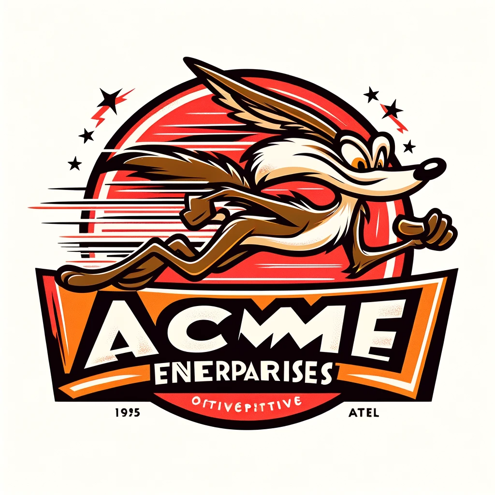
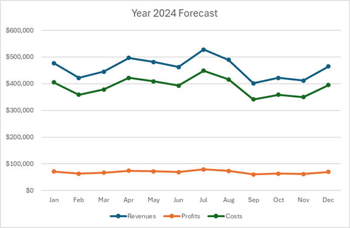
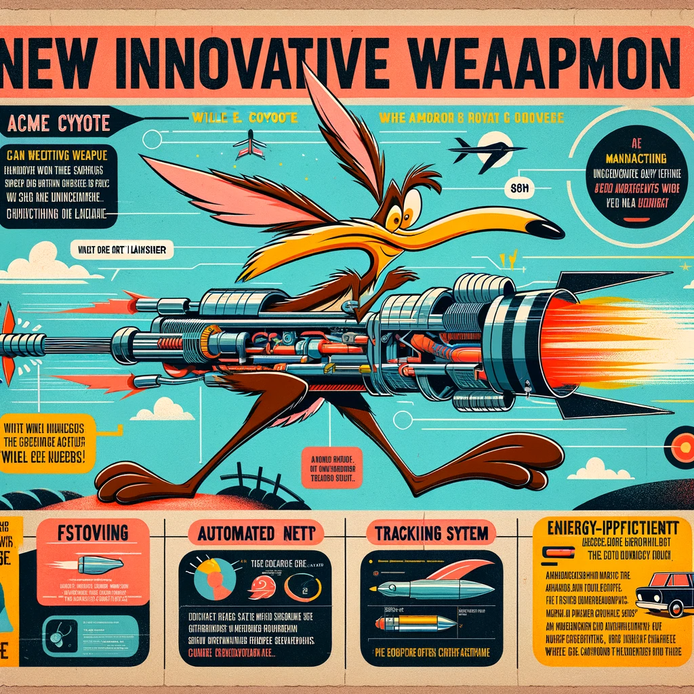
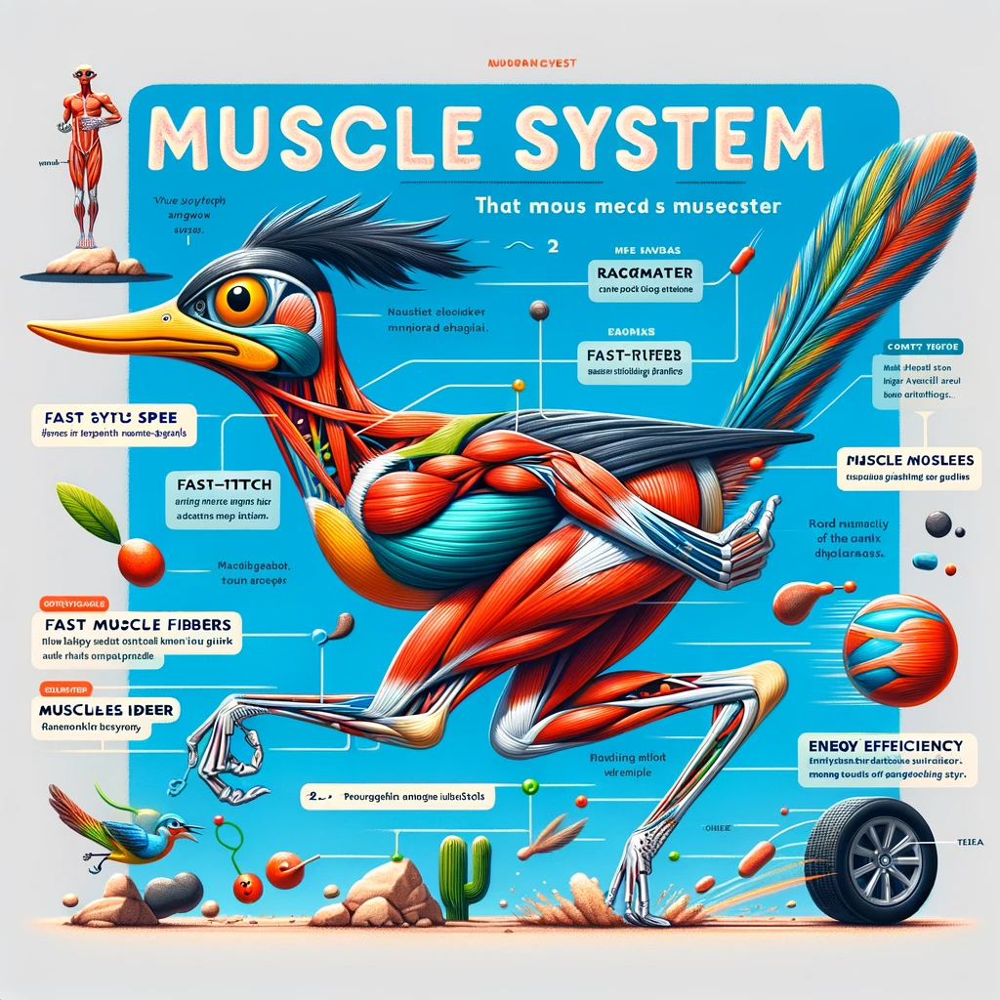
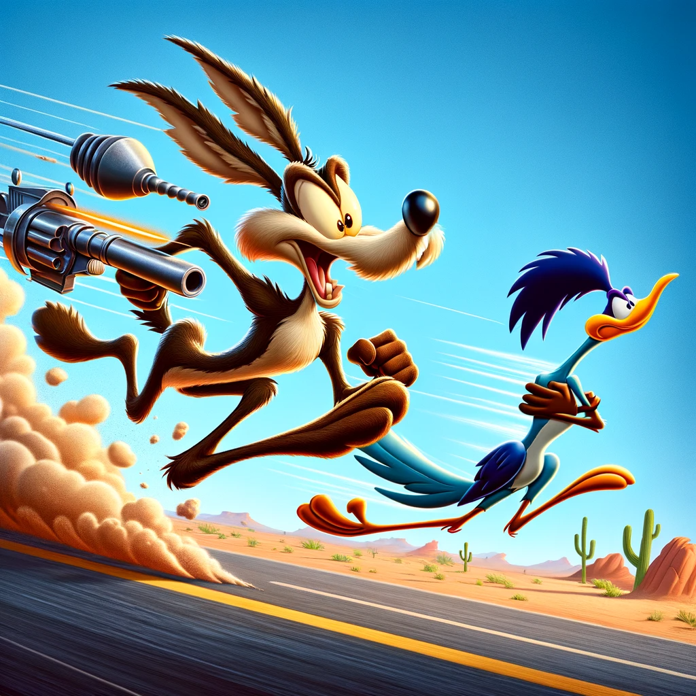
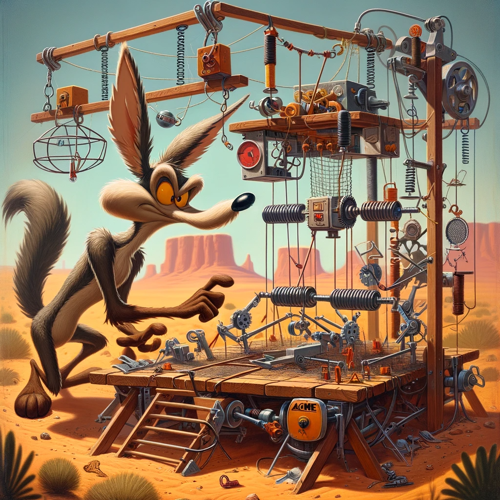
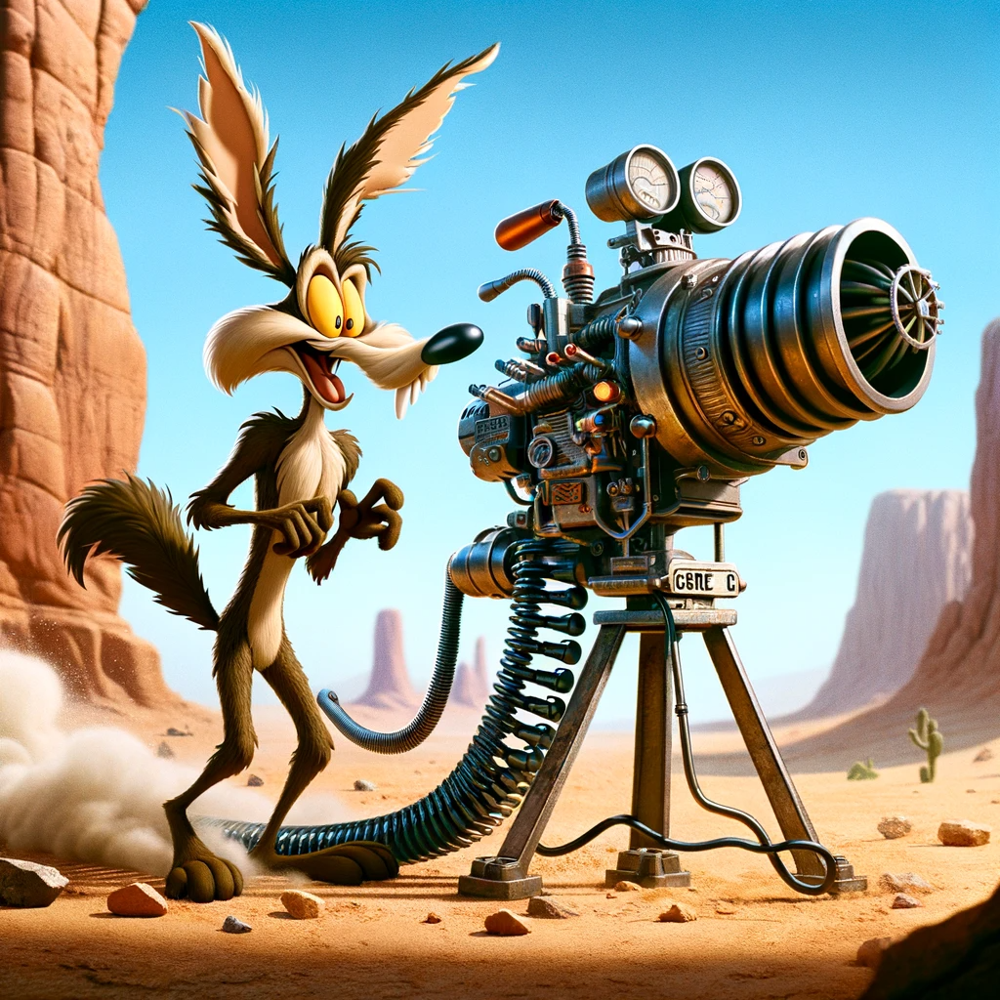

# Investment Proposal for Gru's Enterprises

## ACME Enterprises: Strategic Partnership for Ingenious Solutions

### Address:
Canyon Bluff, The Desert, TX 78910

### Contact Information:
- **Phone:** 555-ACME (555-2263)
- **Email:** coyote@acmeenterprises.com
- **Website:** www.acmeenterprises.com

### Prepared by:
Wile E. Coyote, CEO of ACME Enterprises

### Date of Preparation:
January 6, 2024

---

**Confidential and Proprietary Information**

This document contains confidential and proprietary information of ACME Enterprises. It is intended solely for the use of the individual or entity to which it is addressed. Unauthorized use, dissemination, distribution, or copying of this document is strictly prohibited.

---

 
\pagebreak 

### Table of Contents

1. **Introduction**
   - Background of Wile E. Coyote
   - Overview of the Proposal

2. **Analysis of Gru's Enterprises**
   - Overview of Gru’s Business Document
   - Key Financial Highlights from Gru’s Report
   - Potential Synergies with Coyote’s Objectives

3. **Investment Proposal**
   - Proposal to Acquire 40% Stake
   - Valuation of Gru’s Enterprises
   - Proposed Investment Amount

4. **Financial Projections and Analysis**
   - Revenue Forecast for Next Fiscal Year
   - Projected Impact of Coyote’s Investment
   - Analysis of Potential Return on Investment

5. **Coyote's Projects for Catching the Road Runner**
   - Overview of Past Attempts
   - Proposed Future Strategies
   - Expected Benefits from Gru’s Weapons

6. **Infographics and Visual Representations**
   - Design of a New Innovative Weapon by Coyote
   - Road Runner’s Muscle System Analysis

7. **Graphical Analysis**
   - Hierarchy of Weapons in Coyote’s Arsenal
   - Categories of Past Failed Weapons

8. **Images**
   - Coyote Chasing Road Runner
   - Coyote Setting Up a Trap
   - Coyote Trying a New Weapon from Gru

9. **Conclusion and Call to Action**
   - Summary of the Proposal
   - Next Steps and Contact Information

### 1. Introduction

#### Background of Wile E. Coyote

Wile E. Coyote, the CEO of ACME Enterprises, is known for his relentless pursuit of innovation and creativity, particularly in devising complex strategies to catch the Road Runner. ACME Enterprises has a long history of designing and manufacturing imaginative gadgets and contraptions, aligning perfectly with Coyote's inventive spirit.

#### Overview of the Proposal

This proposal aims to establish a strategic partnership with Gru's Enterprises, leveraging ACME's expertise in imaginative solutions and Gru's proficiency in manufacturing cartoonish weaponry. The collaboration seeks to enhance both companies' product offerings and market reach.

### 2. Analysis of Gru's Enterprises

#### Overview of Gru’s Business Document

Gru’s Enterprises has presented a comprehensive business document, detailing their operations in designing and manufacturing unique "evil" weapons. The document covers financials, operational strategies, and market analysis, demonstrating the company's potential for growth and innovation.

#### Key Financial Highlights from Gru’s Report

Gru's business, while currently barely breaking even, shows significant potential for growth. The financial analysis reveals a well-managed operation with a diverse product range and a strong market presence.

#### Potential Synergies with Coyote’s Objectives

The partnership with Gru's Enterprises aligns perfectly with Coyote's goal of catching the Road Runner. Gru's innovative weaponry could provide Coyote with the edge he needs, combining ACME's ingenuity with Gru's technical expertise.

 
\pagebreak 

### 3. Investment Proposal

#### Proposal to Acquire 40% Stake

Wile E. Coyote proposes to acquire a 40% stake in Gru's Enterprises. This strategic investment aims to infuse capital into Gru's business, facilitating expansion and product development.

#### Valuation of Gru’s Enterprises

Based on the financials provided, the total valuation of Gru's Enterprises is calculated to be $5 million. This valuation takes into account the company's assets, revenue streams, and market potential.

#### Proposed Investment Amount

To acquire a 40% stake in Gru's Enterprises, ACME Enterprises proposes an investment of $2 million. This investment will be utilized to boost R&D, enhance marketing efforts, and expand operational capacity.

### 4. Financial Projections and Analysis

#### Revenue Forecast for Next Fiscal Year
ACME Enterprises projects a significant increase in revenue for Gru's Enterprises post-investment. With the proposed $2 million investment, we anticipate:

- **Year 1 Revenue:** $5.5 million (30% increase)
- **Year 2 Revenue:** $6.5 million (40% cumulative increase)
- **Year 3 Revenue:** $7.5 million (50% cumulative increase)

| **Year** | **Projected Revenue (USD)** | **Projected Profit (USD)** | **ROI (%)** |
|----------|-----------------------------|----------------------------|-------------|
| 2024     | $5,500,000                  | $825,000                   | 12.5        |
| 2025     | $6,500,000                  | $1,300,000                 | 20          |
| 2026     | $7,500,000                  | $1,875,000                 | 35          |

**Chart of Year 1 Financial Projection:** 

#### Projected Impact of Coyote’s Investment
The infusion of capital will be allocated to:

- Expanding R&D for new product lines
- Enhancing marketing strategies
- Streamlining manufacturing processes

This investment is expected to boost efficiency, market reach, and overall profitability.

#### Analysis of Potential Return on Investment
- **Return on Investment (ROI) after 3 Years:** 35%
- **Break-even Point:** End of Year 2
- **Long-term Financial Benefits:** Increased market share and diversified product portfolio

### 5. Coyote's Projects for Catching the Road Runner

#### Overview of Past Attempts
A comprehensive review of past attempts to catch the Road Runner, highlighting the lessons learned and insights gained, which will inform future strategies.

#### Proposed Future Strategies
- Utilization of Gru's advanced weaponry
- Implementation of strategic plans leveraging the combined expertise of ACME and Gru's Enterprises
- Experimental approaches with a focus on innovation and creativity

#### Expected Benefits from Gru’s Weapons
- Enhanced efficiency and effectiveness in Coyote's pursuits
- Increased probability of success in capturing the Road Runner
- Opportunity to test and refine new products in real-world scenarios

### 6. Infographics and Visual Representations

#### Design of a New Innovative Weapon by Coyote
An infographic showcasing a conceptual design of a cutting-edge weapon, combining Coyote's innovative ideas with Gru's manufacturing capabilities. This weapon is specifically tailored for the pursuit of the Road Runner.

#### Road Runner’s Muscle System Analysis
An in-depth infographic analysis of the Road Runner's muscle system, providing insights into its incredible speed and agility. This analysis will inform the design of targeted gadgets and strategies.

 
\pagebreak 

### 7. Graphical Analysis

#### Hierarchy of Weapons in Coyote’s Arsenal
A comprehensive chart detailing the various gadgets and weapons currently in Coyote's arsenal, ranked by effectiveness, complexity, and success rate. This analysis helps in identifying gaps and opportunities for incorporating Gru's weaponry.

| **Weapon**                   | **Effectiveness** | **Complexity** | **Success Rate** |
|------------------------------|-------------------|----------------|------------------|
| Giant Catapult               | High              | Medium         | Low              |
| Rocket Skates                | Medium            | High           | Very Low         |
| ACME Birdseed Trap           | Low               | Low            | Low              |
| Disguise Kit                 | Low               | Low            | Moderate         |
| ACME Portable Hole           | High              | High           | Low              |

#### Categories of Past Failed Weapons
A categorized chart analyzing past weapon failures, focusing on the reasons for their ineffectiveness. This critical evaluation will aid in avoiding past mistakes and improving future designs with Gru's expertise.

| **Category**                | **Number of Attempts** | **Primary Cause of Failure** |
|-----------------------------|------------------------|------------------------------|
| Explosives                  | 15                     | Miscalculation               |
| Mechanical Traps            | 20                     | Malfunction                  |
| Disguises                   | 10                     | Recognition by Road Runner   |
| Direct Pursuit Methods      | 25                     | Speed Differential           |

### 8. Past Experiences

#### Coyote Chasing Road Runner
An image capturing the classic chase, with Coyote utilizing one of Gru's innovative weapons in pursuit of the Road Runner, showcasing the potential effectiveness of the collaboration.

#### Coyote Setting Up a Trap
A depiction of Coyote setting up a complex trap using a combination of ACME and Gru's technology, highlighting the creative and strategic approach to capturing the Road Runner.

#### Coyote Trying a New Weapon from Gru
An illustration of Coyote testing a new, advanced weapon designed by Gru, demonstrating the practical application and potential of this partnership in achieving Coyote's goal.

 
\pagebreak 

### 9. Conclusion and Call to Action

#### Summary of the Proposal
This proposal outlines a strategic partnership between ACME Enterprises and Gru's Enterprises, leveraging strengths from both entities. The investment and collaboration promise to enhance product capabilities, boost financial returns, and finally achieve the elusive goal of catching the Road Runner.

#### Next Steps and Contact Information
- **Next Steps:** Further discussions to finalize investment details and partnership terms.
- **Contact Information:** Wile E. Coyote, CEO of ACME Enterprises; contact details as provided on the cover page.

